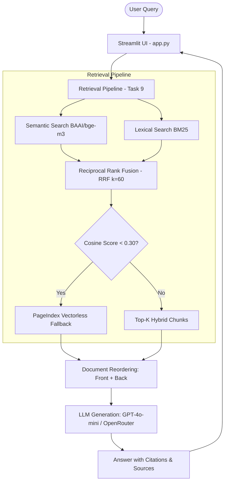

# Bài Tập Nhóm (CP5) — E-commerce Support RAG Chatbot & Evaluation Pipeline

Nhóm thực hiện: **MichelinBoys**

---

## 🎯 Tổng Quan Dự Án

Dự án xây dựng chatbot thông minh hỗ trợ giải đáp các thắc mắc về chính sách thương mại điện tử (đổi trả, thanh toán, ví ShopeePay, SPayLater, bảo mật thông tin, quy định người bán). Dự án bao gồm đầy đủ **Giao diện Chatbot Streamlit** và **RAG Evaluation Pipeline (A/B Testing)**.

### Thành phần chính:
1. **Chatbot Web Application (`app.py`)**: Giao diện Streamlit tương tác, hỗ trợ trích dẫn nguồn (citations), hiển thị điểm số truy xuất, câu hỏi gợi ý và quản lý lịch sử trò chuyện.
2. **Golden Dataset (`group_project/evaluation/golden_dataset.json`)**: Tập dữ liệu kiểm thử chuẩn gồm **16 câu hỏi và câu trả lời kỳ vọng**.
3. **Evaluation Pipeline (`group_project/evaluation/eval_pipeline.py`)**: Tự động đánh giá 4 chỉ số RAG (Faithfulness, Answer Relevance, Context Recall, Context Precision) và thực hiện A/B Testing giữa Hybrid Search vs Dense-Only.
4. **Báo cáo Kết quả (`group_project/evaluation/results.md`)**: Bảng so sánh chi tiết, phân tích thất bại trên 3 mẫu kém nhất (Worst Performers) và đề xuất hướng cải tiến.

---

## 🏗️ Kiến Trúc Hệ Thống



---

## 📋 Phân Công Công Việc Nhóm (MichelinBoys)

| Thành viên | MSSV | Vai trò | Nhiệm vụ đảm nhận | Trạng thái |
|-----------|------|---------|-------------------|------------|
| **Bùi Hoàng Việt** | 2A202601392 | Team Leader & RAG Architect | Quản lý tiến độ, thiết kế kiến trúc tổng thể, tích hợp và kiểm thử toàn bộ RAG pipeline | **Hoàn thành** |
| **Nguyễn Đình Duy** | 2A202601046 | Data & Retrieval Engineer | Chuẩn hóa dữ liệu, chunking, indexing, semantic search và lexical search BM25 | **Hoàn thành** |
| **Hoàng Anh Minh** | 2A202601192 | RAG Pipeline Engineer | Xây dựng reranking, hybrid retrieval, RRF và cơ chế PageIndex fallback | **Hoàn thành** |
| **Trần Trọng Nghĩa** | 2A202601370 | UI & Generation Engineer | Xây dựng generation có citation và giao diện chatbot Streamlit `app.py` | **Hoàn thành** |
| **Nguyễn Thừa Tuân** | 2A202601330 | QA & Evaluation Engineer | Xây dựng golden dataset, evaluation pipeline, so sánh A/B và tổng hợp báo cáo kết quả | **Hoàn thành** |

---

## 📊 Deliverables (Sản Phẩm Bàn Giao CP5)

- [x] **Streamlit UI (`app.py`)**: Chạy ổn định, hỗ trợ citation, top_k slider, clear history, nguồn tham khảo.
- [x] **Golden Dataset (`group_project/evaluation/golden_dataset.json`)**: 16 bộ Q&A được chuẩn hóa từ chính sách thương mại điện tử.
- [x] **Evaluation Script (`group_project/evaluation/eval_pipeline.py`)**: Tính toán tự động 4 metrics RAG và so sánh A/B.
- [x] **Evaluation Report (`group_project/evaluation/results.md`)**: Đầy đủ bảng điểm A/B testing, worst performers & recommendations.

---

## 🚀 Hướng Dẫn Chạy Dự Án

### 1. Khởi động Chatbot UI (Streamlit)
```bash
# Sử dụng virtual environment của dự án
.venv\Scripts\streamlit.exe run app.py
```

### 2. Thực thi RAG Evaluation Pipeline (A/B Testing)
```bash
# Chạy đánh giá và cập nhật báo cáo results.md
.venv\Scripts\python.exe group_project/evaluation/eval_pipeline.py
```

### 3. Kiểm tra toàn bộ Unit Tests
```bash
.venv\Scripts\python.exe -m pytest tests/test_individual.py
```
